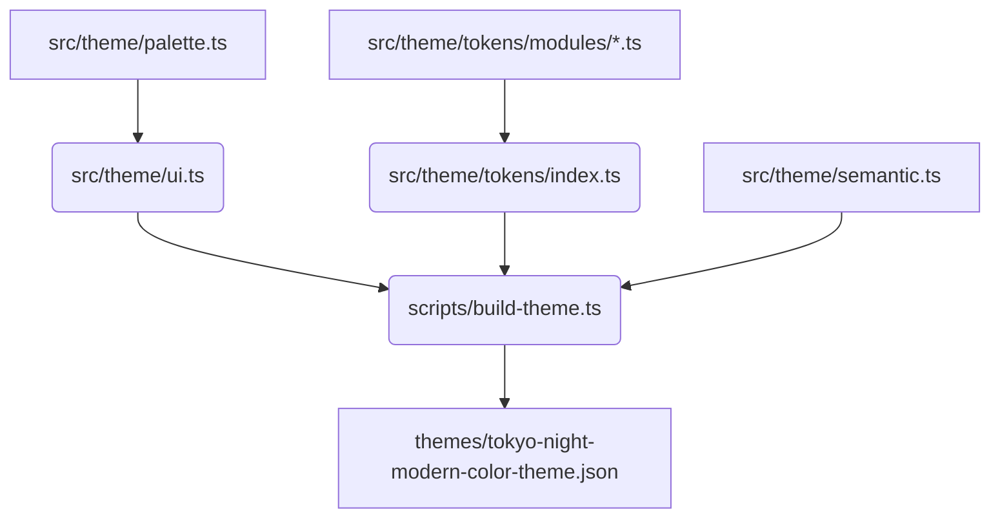

# Contributing to Tokyo Night Modern

First of all, thank you for considering contributing to this project! We welcome any contributions that help us improve the theme.

This document provides guidelines to help you get started.

## Project Structure

The project is organized in a modular way to make it scalable and maintainable. Here's an overview of the key directories:

- `src/theme`: The core of the theme. This is where all colors, tokens, and UI elements are defined.
- `src/theme/palette.ts`: The single source of truth for all colors used in the theme.
- `src/theme/tokens/modules`: Contains token color definitions for different languages (e.g., `typescript.ts`, `python.ts`).
- `src/theme/ui-modules`: Contains UI color definitions for different parts of the VS Code interface (e.g., `editor.ts`, `sidebar.ts`).
- `scripts`: Contains scripts for building, testing, and validating the theme.
- `themes`: Contains the final generated theme file (`tokyo-night-modern-color-theme.json`).

## Build Process

The theme is generated using a TypeScript script. This allows us to use a modular structure and strong typing.

Here is a diagram illustrating the build process:



To build the theme, run the following command:

```bash
npm run build:theme
```

## How to Add a New Color

All colors are defined in `src/theme/palette.ts`. To add a new color, follow these steps:

1. **Open `src/theme/palette.ts`**.
2. **Choose the right color group**:
   - `baseColors`: For general UI colors like backgrounds and foregrounds.
   - `accentColors`: For colors used for highlighting.
   - `syntaxColors`: For colors used in syntax highlighting.
   - `uiColors`: For specific UI elements.
3. **Add your new color** with a descriptive name. For example:

   ```typescript
   const baseColors: ColorPalette = {
     // ...
     newCoolBackground: '#123456',
   }
   ```

4. The build script will automatically generate alpha variants for your new color.

## How to Add a New Syntax or UI Color

To add a new color for a specific syntax token or UI element, follow these steps:

1. **Find the right module**:
   - For syntax colors, find the corresponding language file in `src/theme/tokens/modules`. If it doesn't exist, create a new one.
   - For UI colors, find the corresponding module in `src/theme/ui-modules`.
2. **Add the new token color**:
   - In the chosen module, add a new entry using the `palette` object. For example, to change the color of comments in TypeScript:

   ```typescript
   // src/theme/tokens/modules/typescript.ts
   export const typescriptTokens: TokenColor[] = [
     {
       name: 'TS Comment',
       scope: 'comment.line.ts',
       settings: {
         foreground: palette.comment,
       },
     },
   ]
   ```

3. **Rebuild the theme**:

   ```bash
   npm run build:theme
   ```

## Code Style

We use Prettier and ESLint to maintain a consistent code style. Please make sure to run the format and lint scripts before submitting a pull request.

```bash
npm run format
npm run lint
```

Thank you again for your contribution!
