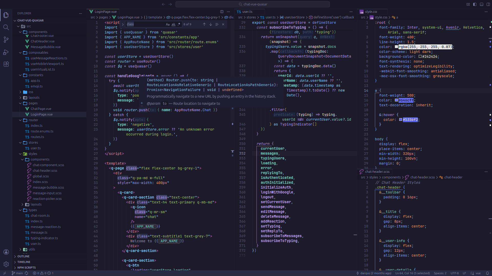

# 🌆 Tokyo Night Modern

> A modern, balanced dark theme for VS Code with declarative color generation and utility-based palette.

## 🌎 Live Preview

🔮 [Open in vscode.dev](https://vscode.dev/theme/lod-inc.tokyo-night-modern)

## 🎨 Features

- **Utility-Based Colors**: All colors derived using `mix()`, `lighten()`, `darken()` utilities
- **Code-First**: TypeScript-based theme generation with type safety
- **Modern Framework Support**: Enhanced tokens for React, Vue, TypeScript, Rust, Go, Python, and more
- **Vibrant UI**: Bright borders, high-contrast selections, and consistent color palette
- **Zero Hardcoded Values**: Every color is computed from base palette

## 📦 Downloads

Download the latest release: [tokyo-night-modern-2.3.1177.vsix](https://github.com/darqus/tokyo-night-modern-vscode-theme/releases/download/v2.3.1177/tokyo-night-modern-2.3.1177.vsix)

## 🚀 Installation

### From Marketplace

1. Open VS Code
2. Press `Ctrl+Shift+X` (Extensions)
3. Search "Tokyo Night Modern"
4. Click Install

### From .vsix File (VSCodium, Cursor, Void, TRAE, Windsurf, ect.)

1. Download the `.vsix` file from the [Downloads](#-downloads) section or [GitHub Releases](https://github.com/darqus/tokyo-night-modern-vscode-theme/releases)
2. Open VS Code
3. Open the Command Palette (`Ctrl+Shift+P` / `Cmd+Shift+P`)
4. Type "Extensions: Install from VSIX..." and select it
5. Navigate to and select the downloaded `.vsix` file
6. Reload VS Code if prompted

## 📄 License

MIT License - see [LICENSE](LICENSE) file
