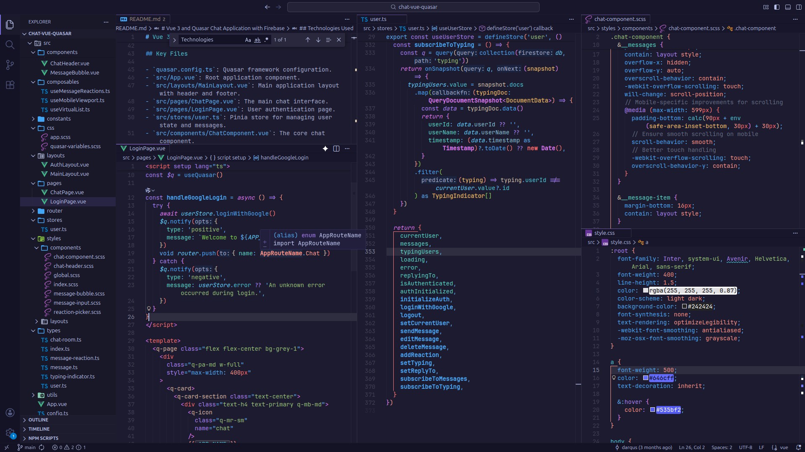

# 🌆 Tokyo Modern

[](https://github.com/darqus/tokyo-modern-vscode-theme/actions/workflows/test.yml)
[](https://marketplace.visualstudio.com/items?itemName=lod-inc.tokyo-modern)
[](https://opensource.org/licenses/MIT)
[](https://marketplace.visualstudio.com/items?itemName=lod-inc.tokyo-modern)
[](https://marketplace.visualstudio.com/items?itemName=lod-inc.tokyo-modern)

> A modern, balanced dark theme for VS Code with declarative color generation and utility-based palette.



## 🌎 Live Preview

 [Open in VS Code](https://vscode.dev/theme/lod-inc.tokyo-modern) |
 [Open in VS Code Insiders](https://insiders.vscode.dev/editor/theme/lod-inc.tokyo-modern)

## 🎨 Features

- **Utility-Based Colors**: All colors derived using `mix()`, `lighten()`, `darken()` utilities
- **Code-First**: TypeScript-based theme generation with type safety
- **Modern Framework Support**: Enhanced tokens for React, Vue, TypeScript, Rust, Go, Python, and more
- **Vibrant UI**: Bright borders, high-contrast selections, and consistent color palette
- **Zero Hardcoded Values**: Every color is computed from base palette

## 🚀 Installation

### From Marketplace

1. Open VS Code
2. Press `Ctrl+Shift+X` (Extensions)
3. Search `Tokyo Modern` or filter by `@id:lod-inc.tokyo-modern`
4. Click Install

### From .vsix File (VSCodium, Cursor, Void, TRAE, Windsurf, etc.)

1. Download the `.vsix` file from [GitHub Releases](https://github.com/darqus/tokyo-modern-vscode-theme/releases/latest)
2. Open VS Code
3. Open the Command Palette (`Ctrl+Shift+P` / `Cmd+Shift+P`)
4. Type "Extensions: Install from VSIX..." and select it
5. Navigate to and select the downloaded `.vsix` file
6. Reload VS Code if prompted

### Recommended configuration

```json
"window.density.editorTabHeight": "compact",
"workbench.colorTheme": "Tokyo Modern",
"workbench.preferredDarkColorTheme": "Tokyo Modern",
"workbench.preferredLightColorTheme": "Tokyo Modern",
```

## 📄 License

MIT License - see [LICENSE](LICENSE) file
