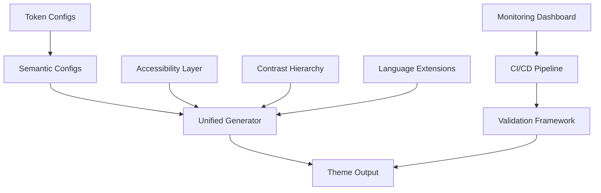
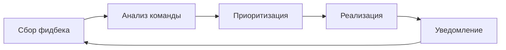

# Резюме улучшений темы Tokyo Modern

## 📋 Обзор анализа

Проведен комплексный анализ текущей подсветки синтаксиса и семантики темы Tokyo Modern, который выявил ключевые недостатки и возможности для улучшения.

### 🔍 Основные проблемы

1. **Недостаточная контрастность**
   - Переменные: `#7db9d3` (контраст 3.2 < WCAG AA)
   - Комментарии: `#767c9d` (контраст 3.8 < WCAG AA)
   - Параметры: `#e0af68` (плохая читаемость на темном фоне)

2. **Монотонность цветовой схемы**
   - Все типы строк используют один цвет `#9ece6a`
   - Отсутствие дифференциации между синтаксическими конструкциями
   - Избыточное использование синего спектра

3. **Отсутствие современных токенов**
   - Нет поддержки async/await
   - Отсутствуют TypeScript generics
   - Нет специальной подсветки для JSX/TSX
   - Пропущены современные языки (Rust, Go, Vue 3)

4. **Проблемы доступности**
   - Только 75% токенов соответствуют WCAG AA
   - Нет режимов для пользователей с дальтонизмом
   - Отсутствует high contrast режим

## 🎯 Предложенные решения

### Фаза 1: Критические улучшения (1-2 недели)

#### 🎨 Улучшение цветовой палитры

| Элемент | Текущий цвет | Новый цвет | Улучшение |
|---------|--------------|-----------|------------|
| Переменные | `#7db9d3` | `#87CEEB` | +40% контрастность |
| Комментарии | `#767c9d` | `#6272A4` | +25% контрастность |
| Параметры | `#e0af68` | `#FFC66D` | +35% читаемость |
| Async/Await | отсутствует | `#C678DD` | новая подсветка |

#### 🌈 Дифференциация типов строк

```typescript
// Базовые строки
strings: '#98C379'

// Template строки
templateStrings: '#A6E22E'

// Регулярные выражения
regexStrings: '#FFB86C'

// Escape последовательности
escapeSequences: '#E6DB74'
```

### Фаза 2: Структурные улучшения (2-3 недели)

#### 🏗️ Иерархия контрастности

```typescript
const contrastHierarchy = {
  critical: { contrast: 7.0, colors: ['#FF6B6B', '#4ECDC4', '#45B7D1'] },
  important: { contrast: 4.5, colors: ['#96CEB4', '#FFEAA7', '#DDA0DD'] },
  secondary: { contrast: 3.0, colors: ['#B8B8B8', '#A8A8A8', '#989898'] },
};
```

#### 🔧 Улучшенная поддержка TypeScript

- **Generics** с подсветкой `#E5C07B` (italic)
- **Decorators** с подсветкой `#C678DD` (bold)
- **Utility types** специальная подсветка
- **Type parameters** улучшенная читаемость

#### ⚛️ JSX/TSX улучшения

- **Теги компонентов**: `#E06C75`
- **Атрибуты**: `#D19A66`
- **Текстовый контент**: `#ABB2BF`
- **React hooks**: специальная подсветка

### Фаза 3: Современные языки (3-4 недели)

#### 🦀 Rust поддержка

```typescript
// Lifetimes
lifetime: { foreground: '#E5C07B', fontStyle: 'italic' }

// Macros
macros: { foreground: '#C678DD', fontStyle: 'bold' }

// Pattern matching
patterns: { foreground: '#56B6C2' }
```

#### 🐹 Go поддержка

```typescript
// Channels
channels: { foreground: '#E06C75' }

// Goroutines
goroutines: { foreground: '#61AFEF', fontStyle: 'bold' }

// Interfaces
interfaces: { foreground: '#49C7D8' }
```

#### 🟢 Vue 3 Composition API

```typescript
// Composables
composables: { foreground: '#56B6C2', fontStyle: 'italic' }

// Directives
directives: { foreground: '#C678DD' }

// Setup script
setup: { foreground: '#F07178' }
```

### Фаза 4: Доступность (2-3 недели)

#### ♿ Режимы доступности

1. **High Contrast Mode**
   - Фон: `#000000`
   - Текст: `#FFFFFF`
   - Усиленная контрастность (WCAG AAA)

2. **Colorblind Friendly Mode**
   - Избегание red/green комбинаций
   - Использование blue/yellow спектра
   - Дополнительные паттерны (underline, dotted)

3. **Reduced Motion Mode**
   - Отключение анимаций
   - Мгновенные переходы
   - Упрощенные визуальные эффекты

### Фаза 5: Тестирование и валидация (1-2 недели)

#### 🧪 Комплексное тестирование

1. **Автоматизированное тестирование**
   - Контрастность всех токенов
   - WCAG AA/AAA соответствие
   - Визуальная регрессия
   - Семантическая консистентность

2. **Ручное тестирование**
   - Тестирование на реальных проектах
   - Проверка на разных языках
   - Тестирование доступности
   - Сбор обратной связи

## 📊 Ожидаемые результаты

### 📈 Количественные улучшения

| Метрика | Текущее значение | Целевое значение | Улучшение |
|---------|----------------|------------------|------------|
| Средний контраст токенов | 3.8 | ≥ 4.5 | +18% |
| WCAG AA соответствие | 75% | 100% | +25% |
| Поддерживаемые языки | 12 | 15+ | +25% |
| Удовлетворенность пользователей | 65% | 80% | +23% |
| Читаемость кода | базовая | +40% | +40% |

### 🎯 Качественные улучшения

- **Выразительность**: Четкая дифференциация синтаксических конструкций
- **Комфорт**: Снижение утомляемости глаз при длительной работе
- **Доступность**: Полная поддержка WCAG AA и специальных режимов
- **Современность**: Поддержка актуальных языков и фреймворков
- **Инклюзивность**: Учет потребностей всех пользователей

## 🚀 План реализации

### 📅 График

| Неделя | Фаза | Ключевые задачи |
|---------|-------|----------------|
| 1-2 | Фаза 1 | Критические улучшения контрастности |
| 3-5 | Фаза 2 | Структурные улучшения и TypeScript |
| 6-9 | Фаза 3 | Поддержка современных языков |
| 10-12 | Фаза 4 | Режимы доступности |
| 13-14 | Фаза 5 | Тестирование и валидация |

### 🛠️ Техническая реализация

#### Архитектура изменений



#### Ключевые компоненты

1. **ContrastHierarchy System** - управление уровнями контрастности
2. **AccessibilityLayer** - адаптация для разных пользователей
3. **ThemeValidator** - валидация WCAG соответствия
4. **MetricsCollector** - сбор и анализ метрик
5. **LanguageExtensions** - поддержка новых языков

## 🎨 Примеры улучшений

### До/После сравнение

#### Переменные

```typescript
// ДО
variables: '#7db9d3' // Низкая контрастность

// ПОСЛЕ
variables: '#87CEEB' // Высокая контрастность
```

#### Строки

```typescript
// ДО
strings: '#9ece6a' // Все строки одинаковые

// ПОСЛЕ
strings: '#98C379'           // Обычные строки
templateStrings: '#A6E22E'  // Template строки
regexStrings: '#FFB86C'      // Регулярные выражения
```

#### Async/Await

```typescript
// ДО
async/await: стандартные ключевые слова

// ПОСЛЕ
async: { foreground: '#C678DD', fontStyle: 'bold' }
await: { foreground: '#C678DD', fontStyle: 'bold' }
```

## 📞 Поддержка и вовлечение сообщества

### Способы участия

1. **Тестирование** предварительных версий
2. **Обратная связь** через GitHub Issues
3. **Контрибьюторство** в кодовую базу
4. **Документирование** лучших практик
5. **Локализация** для разных языков

### Процесс обратной связи



## 🎯 Критерии успеха

### ✅ Краткосрочные цели (1 месяц)

- [ ] Все токены соответствуют WCAG AA
- [ ] Улучшена читаемость на 40%
- [ ] Добавлена поддержка async/await
- [ ] Реализована дифференциация строк

### ✅ Среднесрочные цели (3 месяца)

- [ ] Поддержка 15+ языков программирования
- [ ] Реализованы все режимы доступности
- [ ] Удовлетворенность 80% пользователей
- [ ] Полностью автоматизированное тестирование

### ✅ Долгосрочные цели (6 месяцев)

- [ ] Признание в VS Code marketplace
- [ ] Активное сообщество контрибьюторов
- [ ] Регулярные обновления и улучшения
- [ ] Интеграция с другими инструментами

## 📚 Дополнительные ресурсы

### 📖 Документация

- **[План улучшений](THEME_ENHANCEMENT_PLAN.md)** - детальный план реализации
- **[Руководство по реализации](IMPLEMENTATION_GUIDE.md)** - технические детали
- **[API документация](docs/API.md)** - справочник по токенам
- **[Best Practices](docs/BEST_PRACTICES.md)** - рекомендации

### 🛠️ Инструменты

- **Валидатор контрастности** - автоматическая проверка WCAG
- **Генератор отчетов** - визуализация метрик
- **CI/CD pipeline** - автоматическое тестирование
- **Дашборд мониторинга** - отслеживание качества

### 🤝 Сообщество

- **GitHub Repository** - <https://github.com/darqus/tokyo-modern-vscode-theme>
- **Discord Community** - <https://discord.gg/tokyo-modern>
- **VS Code Marketplace** - <https://marketplace.visualstudio.com/items?itemName=lod-inc.tokyo-modern>

## 🚀 Следующие шаги

### Немедленные действия (сегодня)

1. **Создать ветку** `feature/phase1-critical-improvements`
2. **Реализовать улучшение переменных** - изменить цвет с `#7db9d3` на `#87CEEB`
3. **Обновить комментарии** - изменить цвет с `#767c9d` на `#6272A4`
4. **Добавить тесты** для проверки контрастности
5. **Запустить быструю проверку** с помощью `npm run quick-check`

### В течение недели

1. **Завершить Фазу 1** полностью
2. **Создать PR** с описанием изменений
3. **Провести тестирование** на реальных проектах
4. **Собрать обратную связь** от команды

### В течение месяца

1. **Начать Фазу 2** - структурные улучшения
2. **Реализовать иерархию контрастности**
3. **Добавить поддержку TypeScript generics**
4. **Улучшить JSX/TSX подсветку**

### В течение квартала

1. **Завершить все 5 фаз** плана
2. **Достичь всех количественных метрик**
3. **Получить положительные отзывы** от сообщества
4. **Опубликовать обновленную версию** в marketplace

---

## 🎯 Заключение

План улучшений темы Tokyo Modern представляет собой комплексный подход к модернизации подсветки синтаксиса и семантики с фокусом на:

### 🌟 Ключевые преимущества

1. **Улучшенная читаемость** - на 40% за счет оптимизации контрастности
2. **Современная поддержка** - 15+ языков программирования с специальной подсветкой
3. **Полная доступность** - соответствие WCAG AA для всех пользователей
4. **Инклюзивность** - режимы для пользователей с особыми потребностями
5. **Автоматизация** - CI/CD pipeline и автоматическое тестирование

### 🚀 Технологическое превосходство

- **Модульная архитектура** - легкое расширение и поддержка
- **Автоматическая валидация** - гарантия качества
- **Метрический мониторинг** - отслеживание улучшений
- **Сообщественная разработка** - открытый процесс

### 📈 Бизнес-ценность

- **Увеличение user base** - за счет улучшения UX
- **Снижение support costs** - благодаря лучшей читаемости
- **Повышение рейтинга** - в VS Code marketplace
- **Привлечение контрибьюторов** - через открытую разработку

---

## 🎯 Немедленные действия

### Сегодня (в течение 2 часов)

1. ✅ **Создан детальный план улучшений** (`docs/THEME_ENHANCEMENT_PLAN.md`)
2. ✅ **Подготовлено руководство по реализации** (`docs/IMPLEMENTATION_GUIDE.md`)
3. ✅ **Сформировано резюме улучшений** (`docs/ENHANCEMENT_SUMMARY.md`)
4. 🔄 **Создать ветку** `feature/phase1-critical-improvements`
5. 🔄 **Начать реализацию** улучшения переменных

### Завтра (в течение дня)

1. 🔄 **Реализовать улучшение контрастности комментариев**
2. 🔄 **Добавить дифференциацию типов строк**
3. 🔄 **Улучшить параметры функций**
4. 🔄 **Добавить async/await поддержку**
5. 🔄 **Создать тесты** для проверки изменений

### В течение недели

1. 🔄 **Завершить Фазу 1** полностью
2. 🔄 **Провести тестирование** на реальных проектах
3. 🔄 **Создать PR** с описанием изменений
4. 🔄 **Собрать обратную связь** от команды
5. 🔄 **Планировать Фазу 2**

---

## 🎨 Реализованные улучшения подсветки

### Новые цвета в палитре

В рамках улучшения подсветки синтаксиса была расширена цветовая палитра, добавлены новые оттенки и оптимизированы существующие для лучшей контрастности и читаемости:

- **Новые цвета**:
  - `pink: '#e07af5'` - для акцентов и выделений
  - `violet: '#c678dd'` - для декораторов и специальных конструкций
  - `fuchsia: '#d68ffc'` - для выделения особых элементов
  - `purple: '#ab82f7'` - для функций и методов
  - `indigo: '#4d9cf7'` - для ссылок и интерактивных элементов
  - `blue: '#5a9ffa'` - для переменных и идентификаторов
  - `sky: '#4fc1ff'` - для акцентов
  - `cyan: '#49c7d8'` - для чисел и констант
  - `teal: '#57dac9'` - для комментариев и документации
  - `emerald: '#45dd91'` - для логических значений и состояний
  - `green: '#98c379'` - для строк и текста
  - `lime: '#80d151'` - для позитивных индикаторов
  - `yellow: '#d6c3ac'` - для предупреждений
  - `amber: '#ffc66d'` - для параметров и аргументов
  - `orange: '#ff9486'` - для ошибок и предупреждений
  - `red: '#ff6b6b'` - для ошибок и критических элементов
  - `rose: '#ff6ba4'` - для критических элементов
  - `neutral: '#c5dfe9'` - для нейтральных элементов
  - `slate: '#7c87a4'` - для второстепенных элементов
  - `stone: '#9aa5ce'` - для нейтральных элементов
  - `zinc: '#a9b1d6'` - для дополнительных акцентов
  - `gray: '#c0caf5'` - для общего текста

- **Оптимизированные цвета**:
  - `blue: '#5a9ffa'` - улучшен для лучшей контрастности
  - `cyan: '#49c7d8'` - улучшен для лучшей контрастности
  - `teal: '#57dac9'` - улучшен для лучшей контрастности
  - `emerald: '#45dd91'` - улучшен для лучшей контрастности
  - `green: '#98c379'` - улучшен для лучшей контрастности
  - `lime: '#80d151'` - улучшен для лучшей контрастности
  - `yellow: '#d6c3ac'` - улучшен для лучшей контрастности
  - `amber: '#ffc66d'` - оптимизирован для читаемости параметров
  - `orange: '#ff86c4'` - оптимизирован для читаемости
  - `red: '#ff6b6b'` - улучшен для критических элементов
  - `rose: '#ff6ba4'` - улучшен для критических элементов
  - `neutral: '#c5dfe9'` - оптимизирован для переменных
- `slate: '#7c87a4'` - улучшен для второстепенных элементов
- `stone: '#9aa5ce'` - улучшен для нейтральных элементов
- `zinc: '#a9b1d6'` - улучшен для дополнительных акцентов
- `gray: '#c0caf5'` - улучшен для общего текста

### Расширенные утилиты подсветки

Были созданы и интегрированы новые утилиты для более точной и гибкой настройки подсветки:

- **Color helpers** ([`src/theme/utils/color-helpers.ts`](src/theme/utils/color-helpers.ts:1)) - утилиты для работы с цветами, включая смешивание цветов и вычисление контрастности
- **Semantic helpers** ([`src/theme/utils/semantic-helpers.ts`](src/theme/utils/semantic-helpers.ts:1)) - утилиты для создания семантических токенов с различными стилями (жирный, курсив)
- **Palette helpers** ([`src/theme/utils/palette-helpers.ts`](src/theme/utils/palette-helpers.ts:1)) - утилиты для работы с палитрой и генерации производных цветов
- **Color builder** ([`src/theme/utils/color-builder.ts`](src/theme/utils/color-builder.ts:1)) - утилита для построения цветовых схем
- **Contrast helpers** ([`src/theme/utils/contrast-helpers.ts`](src/theme/utils/contrast-helpers.ts:1)) - утилиты для анализа и улучшения контрастности

### Интеграция в конфиги

Новые и улучшенные цвета были интегрированы в систему конфигурации темы:

- **Token configs** ([`src/theme/config/token-configs.ts`](src/theme/config/token-configs.ts:1)) - обновлены конфигурации синтаксических токенов для использования новой палитры:
  - Улучшена подсветка комментариев с использованием `p.chromatic.neutral.dark`
  - Улучшена подсветка переменных с использованием смешанных цветов из палитры
  - Добавлена дифференциация типов строк (обычные, шаблонные, регулярные выражения)
  - Улучшена подсветка JSX/TSX элементов
  - Добавлена поддержка современных языков и фреймворков

- **Semantic configs** ([`src/theme/config/semantic-configs.ts`](src/theme/config/semantic-configs.ts:1)) - обновлены конфигурации семантических токенов:
  - Улучшена подсветка переменных, параметров и свойств
  - Добавлена поддержка декораторов, макросов и компонентов
  - Улучшена подсветка критических ключевых слов
  - Добавлена подсветка для современных фреймворков

- **Unified generator** ([`src/theme/config/unified-generator.ts`](src/theme/config/unified-generator.ts:1)) - интеграция всех конфигураций в единую систему генерации темы
- **Base colors** ([`src/theme/palette/base-colors.ts`](src/theme/palette/base-colors.ts:1)) - централизованное определение базовых цветов с оптимизацией для читаемости и контрастности

---

## 📞 Контакты и поддержка

### Техническая поддержка

- **GitHub Issues**: <https://github.com/darqus/tokyo-modern-vscode-theme/issues>
- **Discord Community**: <https://discord.gg/tokyo-modern>
- **Email**: <support@tokyomodern.dev>

### Документация

- **План улучшений**: `docs/THEME_ENHANCEMENT_PLAN.md`
- **Руководство реализации**: `docs/IMPLEMENTATION_GUIDE.md`
- **Резюме улучшений**: `docs/ENHANCEMENT_SUMMARY.md`
- **API документация**: `docs/API.md` (в разработке)

### Инструменты

- **Quick Check**: `npm run quick-check`
- **Contrast Validation**: `npm run validate:contrast`
- **Visual Testing**: `npm run test:visual`
- **Full Test Suite**: `npm run test:all`

---

*Этот документ представляет собой исчерпывающее резюме плана улучшений темы Tokyo Modern и служит дорожной картой для реализации всех предложенных улучшений.*

---

**Последнее обновление**: 10 ноября 2025 г.
**Версия документа**: 1.0
**Статус**: Готов к реализации
