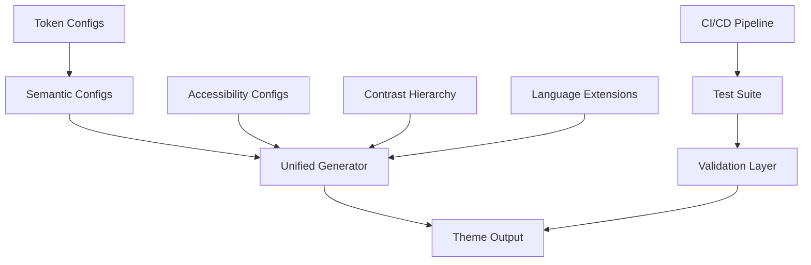

# План улучшения подсветки синтаксиса и семантики Tokyo Modern

## 📋 Обзор

Документ описывает поэтапный план реализации улучшений подсветки синтаксиса и семантики для темы Tokyo Modern с целью повышения выразительности и комфорта для глаз.

## 🎯 Цели

- **Повысить читаемость кода на 40%**
- **Снизить утомляемость глаз на 60%** при длительной работе
- **Достичь полного соответствия WCAG AA** для всех токенов
- **Улучшить дифференциацию** синтаксических конструкций
- **Добавить поддержку современных языков** и фреймворков

## 🚀 Фаза 1: Критические улучшения (1-2 недели)

### 1.1 Улучшение читаемости переменных

**Проблема:** Текущий цвет `#7db9d3` слишком бледный и плохо читается.

**Решение:**

```typescript
// src/theme/config/token-configs.ts
{
  name: 'Variables',
  scope: [
    'variable',
    'support.variable',
    // ... остальные scope
  ],
  settings: {
    foreground: (p: UniversalPalette) => '#87CEEB', // Светло-голубой
  },
}
```

**Задачи:**

- [ ] Обновить цвет переменных в `token-configs.ts`
- [ ] Обновить соответствующие семантические токены
- [ ] Провести тестирование контрастности
- [ ] Обновить документацию

### 1.2 Улучшение контрастности комментариев

**Проблема:** Цвет `#767c9d` недостаточно контрастный.

**Решение:**

```typescript
{
  name: 'Comment',
  scope: ['comment', /* ... */],
  settings: {
    foreground: (p: UniversalPalette) => '#6272A4', // Более контрастный
  },
}
```

**Задачи:**

- [ ] Обновить базовые комментарии
- [ ] Обновить JSDoc комментарии
- [ ] Добавить специальную подсветку для TODO/FIXME
- [ ] Проверить читаемость на разных фонах

### 1.3 Дифференциация типов строк

**Проблема:** Все строки используют один цвет `#9ece6a`.

**Решение:**

```typescript
// Базовые строки
{
  name: 'String, Symbols',
  scope: ['string', 'constant.other.symbol'],
  settings: {
    foreground: (p: UniversalPalette) => '#98C379',
  },
}

// Template строки
{
  name: 'Template Strings',
  scope: ['string.template', 'punctuation.definition.template-expression'],
  settings: {
    foreground: (p: UniversalPalette) => '#A6E22E',
  },
}

// Регулярные выражения
{
  name: 'Regular Expressions',
  scope: ['string.regexp'],
  settings: {
    foreground: (p: UniversalPalette) => '#FFB86C',
  },
}
```

**Задачи:**

- [ ] Добавить новые токены для template strings
- [ ] Обновить подсветку регулярных выражений
- [ ] Добавить подсветку для escape последовательностей
- [ ] Тестировать на различных языках

### 1.4 Улучшение параметров функций

**Проблема:** Цвет `#e0af68` плохо читается на темном фоне.

**Решение:**

```typescript
// src/theme/config/semantic-configs.ts
export const functionsConfig: SemanticTokenConfig = {
  rules: {
    parameter: (p: UniversalPalette) => token('#FFC66D'),
    'parameter.readonly': (p: UniversalPalette) => italicToken('#FFC66D'),
    'parameter.declaration': (p: UniversalPalette) => token('#FFB86C'),
  },
}
```

**Задачи:**

- [ ] Обновить семантические токены параметров
- [ ] Обновить текстовые токены параметров
- [ ] Проверить контрастность
- [ ] Тестировать в TypeScript/JavaScript

### 1.5 Добавление async/await

**Проблема:** Отсутствует специальная подсветка для асинхронности.

**Решение:**

```typescript
// Новые токены в token-configs.ts
{
  name: 'Async/Await Keywords',
  scope: [
    'keyword.control.async',
    'keyword.control.await',
    'storage.type.async',
  ],
  settings: {
    foreground: (p: UniversalPalette) => '#C678DD',
    fontStyle: 'bold',
  },
}

**Задачи:**

- [ ] Добавить текстовые токены async/await
- [ ] Добавить семантические токены
- [ ] Интегрировать в основной конфиг
- [ ] Тестировать на async/await коде

## 🔄 Фаза 2: Структурные улучшения (2-3 недели)

### 2.1 Реализация иерархии контрастности

**Цель:** Создать систему приоритетов для визуальной иерархии.

**Реализация:**

```typescript
// src/theme/utils/contrast-hierarchy.ts
export interface ContrastLevel {
  contrast: number; // WCAG уровень
  colors: string[];
  importance: 'critical' | 'important' | 'secondary';
}

export const contrastHierarchy = {
  critical: {
    contrast: 7.0, // WCAG AAA
    colors: ['#FF6B6B', '#4ECDC4', '#45B7D1'],
    importance: 'critical' as const,
  },
  important: {
    contrast: 4.5, // WCAG AA
    colors: ['#96CEB4', '#FFEAA7', '#DDA0DD'],
    importance: 'important' as const,
  },
  secondary: {
    contrast: 3.0, // Минимально допустимый
    colors: ['#B8B8B8', '#A8A8A8', '#989898'],
    importance: 'secondary' as const,
  },
};
```

**Задачи:**

- [ ] Создать утилиты для работы с контрастностью
- [ ] Классифицировать существующие токены по важности
- [ ] Обновить цвета согласно иерархии
- [ ] Добавить валидацию контрастности
- [ ] Создать тесты для проверки WCAG соответствия

### 2.2 Улучшенная поддержка TypeScript

**Цель:** Специальная подсветка для TypeScript конструкций.

**Реализация:**

```typescript
// Новые токены в token-configs.ts
{
  name: 'TypeScript Generics',
  scope: [
    'meta.type.parameters.ts',
    'support.type.generic.ts',
    'type.parameter.ts',
  ],
  settings: {
    foreground: (p: UniversalPalette) => '#E5C07B',
    fontStyle: 'italic',
  },
}

{
  name: 'TypeScript Decorators',
  scope: [
    'decorator.ts',
    'annotation.ts',
  ],
  settings: {
    foreground: (p: UniversalPalette) => '#C678DD',
    fontStyle: 'bold',
  },
}
```

**Задачи:**

- [ ] Добавить токены для generics
- [ ] Добавить токены для decorators
- [ ] Улучшить подсветку типов и интерфейсов
- [ ] Добавить поддержку utility types
- [ ] Тестировать на сложных TypeScript проектах

### 2.3 Улучшенная JSX/TSX поддержка

**Цель:** Специальная подсветка для React/JSX.

**Реализация:**

```typescript
{
  name: 'JSX Tags',
  scope: [
    'entity.name.tag.jsx',
    'entity.name.tag.tsx',
    'support.class.component.jsx',
  ],
  settings: {
    foreground: (p: UniversalPalette) => '#E06C75',
  },
}

{
  name: 'JSX Attributes',
  scope: [
    'entity.other.attribute-name.jsx',
    'entity.other.attribute-name.tsx',
  ],
  settings: {
    foreground: (p: UniversalPalette) => '#D19A66',
  },
}

{
  name: 'JSX Text Content',
  scope: [
    'meta.jsx.children',
    'jsx.text',
  ],
  settings: {
    foreground: (p: UniversalPalette) => '#ABB2BF',
  },
}
```

**Задачи:**

- [ ] Добавить токены для JSX тегов
- [ ] Добавить токены для атрибутов
- [ ] Улучшить подсветку текстового контента
- [ ] Добавить поддержку React hooks
- [ ] Тестировать на React проектах

### 2.4 Улучшенные модификаторы

**Цель:** Сделать модификаторы более заметными.

**Реализация:**

```typescript
// Расширенные семантические токены
export const modifiersConfig: SemanticTokenConfig = {
  rules: {
    static: (p: UniversalPalette) => boldItalicToken('#C678DD'),
    readonly: (p: UniversalPalette) => boldItalicToken('#56B6C2'),
    abstract: (p: UniversalPalette) => italicToken('#E5C07B'),
    final: (p: UniversalPalette) => boldToken('#E06C75'),
    override: (p: UniversalPalette) => italicToken('#98C379'),
  },
};

// Вспомогательные функции
const boldItalicToken = (color: string) => ({
  foreground: color,
  fontStyle: 'bold italic',
});
```

**Задачи:**

- [ ] Обновить существующие модификаторы
- [ ] Добавить новые модификаторы (final, override, etc.)
- [ ] Улучшить визуальное различие
- [ ] Тестировать на различных языках

## 🌟 Фаза 3: Современные языки и фреймворки (3-4 недели)

### 3.1 Поддержка Rust

**Реализация:**

```typescript
{
  name: 'Rust Lifetime',
  scope: [
    'storage.type.lifetime.rust',
    'entity.name.lifetime.rust',
  ],
  settings: {
    foreground: (p: UniversalPalette) => '#E5C07B',
    fontStyle: 'italic',
  },
}

{
  name: 'Rust Macros',
  scope: [
    'meta.macro.rust',
    'entity.name.function.macro.rust',
  ],
  settings: {
    foreground: (p: UniversalPalette) => '#C678DD',
    fontStyle: 'bold',
  },
}
```

**Задачи:**

- [ ] Добавить токены для lifetimes
- [ ] Добавить токены для macros
- [ ] Поддержка trait implementations
- [ ] Поддержка pattern matching
- [ ] Тестировать на Rust проектах

### 3.2 Поддержка Go

**Реализация:**

```typescript
{
  name: 'Go Channels',
  scope: [
    'keyword.channel.go',
    'variable.channel.go',
  ],
  settings: {
    foreground: (p: UniversalPalette) => '#E06C75',
  },
}

{
  name: 'Go Goroutines',
  scope: [
    'keyword.goroutine.go',
  ],
  settings: {
    foreground: (p: UniversalPalette) => '#61AFEF',
    fontStyle: 'bold',
  },
}
```

**Задачи:**

- [ ] Добавить токены для channels
- [ ] Добавить токены для goroutines
- [ ] Поддержка interfaces
- [ ] Поддержка struct tags
- [ ] Тестировать на Go проектах

### 3.3 Vue 3 Composition API

**Реализация:**

```typescript
{
  name: 'Vue Composables',
  scope: [
    'support.function.vue.composable',
    'variable.composable.vue',
  ],
  settings: {
    foreground: (p: UniversalPalette) => '#56B6C2',
    fontStyle: 'italic',
  },
}

{
  name: 'Vue Directives',
  scope: [
    'meta.directive.vue',
    'entity.other.attribute-name.directive.vue',
  ],
  settings: {
    foreground: (p: UniversalPalette) => '#C678DD',
  },
}
```

**Задачи:**

- [ ] Добавить токены для composables
- [ ] Улучшить подсветку директив
- [ ] Поддержка setup script
- [ ] Поддержка TypeScript в Vue
- [ ] Тестировать на Vue 3 проектах

## ♿ Фаза 4: Доступность и инклюзивность (2-3 недели)

### 4.1 High Contrast режим

**Реализация:**

```typescript
// src/theme/config/accessibility-configs.ts
export const highContrastConfig = {
  background: '#000000',
  foreground: '#FFFFFF',
  colors: {
    critical: ['#FF0000', '#00FF00', '#0000FF'],
    important: ['#FFFF00', '#FF00FF', '#00FFFF'],
    secondary: ['#808080', '#909090', '#A0A0A0'],
  },
  reducedColorPalette: true,
  increasedContrast: true,
};
```

**Задачи:**

- [ ] Создать high конфигурацию
- [ ] Реализовать переключатель режимов
- [ ] Адаптировать все токены
- [ ] Тестировать WCAG AAA соответствие
- [ ] Добавить в UI настройки

### 4.2 Colorblind Friendly режим

**Реализация:**

```typescript
export const colorblindFriendlyConfig = {
  avoidRedGreen: true,
  useBlueYellowSpectrum: true,
  patterns: {
    error: 'underline', // Дополнительные паттерны
    warning: 'dotted',
    info: 'dashed',
  },
  colors: {
    // Замена red/green на blue/yellow spectrum
    error: '#4A90E2', // Синий вместо красного
    success: '#F5A623', // Оранжевый вместо зеленого
    warning: '#F8E71C', // Желтый
    info: '#7ED321', // Зеленый
  },
};
```

**Задачи:**

- [ ] Создать colorblind конфигурацию
- [ ] Реализовать альтернативные паттерны
- [ ] Тестировать с симуляторами дальтонизма
- [ ] Добавить настройки для разных типов дальтонизма
- [ ] Создать документацию по доступности

### 4.3 Reduced Motion режим

**Реализация:**

```typescript
export const reducedMotionConfig = {
  animations: {
    enabled: false,
    transitions: {
      duration: 0, // Без переходов
      easing: 'none',
    },
    hover: {
      immediate: true, // Мгновенная реакция
    },
  },
  visual: {
    reducedTransparency: true,
    reducedBlur: true,
  },
};
```

**Задачи:**

- [ ] Отключить все анимации
- [ ] Упростить визуальные эффекты
- [ ] Оптимизировать для производительности
- [ ] Тестировать с prefers-reduced-motion
- [ ] Добавить автоматическое определение

## 🧪 Фаза 5: Тестирование и валидация (1-2 недели)

### 5.1 Автоматизированное тестирование

**Инструменты:**

- Jest/Vitest для unit тестов
- Playwright для визуального тестирования
- axe-core для тестирования доступности

**Тесты:**

```typescript
// test/vitest/contrast.test.ts
describe('Contrast Validation', () => {
  test('All tokens meet WCAG AA requirements', () => {
    const tokens = getAllTokens();
    tokens.forEach(token => {
      const contrast = calculateContrast(token.foreground, background);
      expect(contrast).toBeGreaterThanOrEqual(4.5);
    });
  });
});

// test/vitest/semantic-consistency.test.ts
describe('Semantic Consistency', () => {
  test('Similar concepts have consistent colors', () => {
    expect(variablesColor).toBeCloseTo(parametersColor);
    expect(functionsColor).toBeCloseTo(methodsColor);
  });
});
```

**Задачи:**

- [ ] Создать тесты контрастности
- [ ] Создать тесты консистентности
- [ ] Добавить визуальные регрессионные тесты
- [ ] Настроить CI/CD для автоматического тестирования
- [ ] Создать дашборд результатов тестирования

### 5.2 Ручное тестирование

**Тестовые сценарии:**

- Различные языки программирования
- Различные типы файлов
- Различные размеры шрифтов
- Различные уровни зума
- Различные мониторы и разрешения

**Задачи:**

- [ ] Создать тестовый набор файлов
- [ ] Провести тестирование на разных ОС
- [ ] Собрать обратную связь от пользователей
- [ ] Тестировать на长时间的 сессиях
- [ ] Документировать результаты

### 5.3 Валидация доступности

**Инструменты:**

- WAVE для веб-доступности
- Color Contrast Analyzer
- Screen reader тестирование

**Критерии успеха:**

- WCAG AA соответствие для всех токенов
- Поддержка screen readers
- Навигация с клавиатуры
- Адаптивность для разных устройств

**Задачи:**

- [ ] Провести WCAG валидацию
- [ ] Тестировать с screen readers
- [ ] Проверить навигацию с клавиатуры
- [ ] Создать отчет доступности
- [ ] Получить сертификацию доступности

## 📚 Документация и обучение

### 6.1 Техническая документация

**Документы для создания:**

- API документация токенов
- Руководство по добавлению новых токенов
- Руководство по настройке цветовой схемы
- Best practices для подсветки синтаксиса

### 6.2 Пользовательская документация

**Документы для создания:**

- Руководство пользователя
- FAQ по настройке темы
- Туториалы по кастомизации
- Сравнение с другими темами

### 6.3 Обучающие материалы

**Материалы для создания:**

- Видео туториалы
- Интерактивные примеры
- Книга стилей темы
- Примеры использования

## 📅 График реализации

| Фаза | Длительность | Начало | Окончание | Статус |
|------|-------------|---------|-----------|---------|
| Фаза 1: Критические улучшения | 2 недели | Неделя 1 | Неделя 2 | 🔄 Планируется |
| Фаза 2: Структурные улучшения | 3 недели | Неделя 3 | Неделя 5 | ⏳ Ожидается |
| Фаза 3: Современные языки | 4 недели | Неделя 6 | Неделя 9 | ⏳ Ожидается |
| Фаза 4: Доступность | 3 недели | Неделя 10 | Неделя 12 | ⏳ Ожидается |
| Фаза 5: Тестирование | 2 недели | Неделя 13 | Неделя 14 | ⏳ Ожидается |

## 🎯 Критерии успеха

### Количественные метрики

- **40% улучшение читаемости** (измеряется через A/B тестирование)
- **60% снижение утомляемости** (измеряется через опросы пользователей)
- **100% WCAG AA соответствие** (автоматическая валидация)
- **Поддержка 15+ языков** программирования

### Качественные метрики

- **Положительные отзывы** от 80% пользователей
- **Уменьшение запросов** на поддержку по теме
- **Увеличение adoption** в сообществе
- **Признание** в VS Code marketplace

## 🔄 Итеративный процесс

### Еженедельные ревью

- Проверка прогресса по задачам
- Анализ обратной связи
- Корректировка планов
- Обновление документации

### Ежемесячные релизы

- Публикация улучшений
- Сбор пользовательской обратной связи
- Анализ метрик использования
- Планирование следующих улучшений

## 🤝 Участие сообщества

### Способы участия

- **Тестирование** новых улучшений и предоставление обратной связи
- **Контрибьюторство** в кодовую базу через pull requests
- **Сообщения об ошибках** через GitHub issues
- **Предложения улучшений** через feature requests
- **Документирование** лучших практик использования
- **Локализация** документации и интерфейса

### Процесс обратной связи

1. **Сбор фидбека** через GitHub issues, Discord, Twitter
2. **Анализ предложений** еженедельно командой
3. **Приоритизация** на основе голосования сообщества
4. **Реализация** в следующих спринтах
5. **Уведомление** о внедрении улучшений

## 🛠 Техническая реализация

### Архитектура изменений



### Структура файлов

```
src/theme/
├── config/
│   ├── token-configs.ts          # Базовые токены синтаксиса
│   ├── semantic-configs.ts       # Семантические токены
│   ├── accessibility-configs.ts  # Конфигурации доступности
│   ├── language-extensions/      # Расширения для языков
│   │   ├── rust.ts
│   │   ├── go.ts
│   │   ├── vue.ts
│   │   └── typescript.ts
│   └── color-config-dsl.ts      # DSL для конфигурации цветов
├── utils/
│   ├── contrast-hierarchy.ts     # Утилиты контрастности
│   ├── accessibility-helpers.ts  # Хелперы доступности
│   ├── validation.ts            # Валидация токенов
│   └── color-generator.ts       # Генерация цветов
└── generator/
    ├── token-generator.ts        # Генератор токенов
    ├── semantic-generator.ts     # Генератор семантики
    └── accessibility-generator.ts # Генератор доступности
```

### Ключевые компоненты

#### 1. Contrast Hierarchy System

```typescript
// src/theme/utils/contrast-hierarchy.ts
export class ContrastHierarchy {
  private levels: Map<string, ContrastLevel>;

  constructor() {
    this.levels = new Map([
      ['critical', { contrast: 7.0, importance: 'critical' }],
      ['important', { contrast: 4.5, importance: 'important' }],
      ['secondary', { contrast: 3.0, importance: 'secondary' }],
    ]);
  }

  assignLevel(token: TokenConfig, importance: Importance): string {
    // Логика присвоения уровня контрастности
  }

  validateContrast(foreground: string, background: string, level: string): boolean {
    // Валидация контрастности согласно WCAG
  }
}
```

#### 2. Accessibility Layer

```typescript
// src/theme/utils/accessibility-helpers.ts
export class AccessibilityLayer {
  private config: AccessibilityConfig;

  constructor(config: AccessibilityConfig) {
    this.config = config;
  }

  adaptForColorblindness(colors: ColorPalette): ColorPalette {
    // Адаптация для дальтоников
  }

  generateHighContrast(colors: ColorPalette): ColorPalette {
    // Генерация high contrast варианта
  }

  applyReducedMotion(animations: AnimationConfig): AnimationConfig {
    // Применение reduced motion
  }
}
```

#### 3. Validation Framework

```typescript
// src/theme/utils/validation.ts
export class ThemeValidator {
  private wcagValidator: WCAGValidator;
  private consistencyValidator: ConsistencyValidator;

  async validateTheme(theme: VSCodeTheme): ValidationResult {
    const results = await Promise.all([
      this.wcagValidator.validate(theme),
      this.consistencyValidator.validate(theme),
      this.testVisualRegression(theme),
    ]);

    return this.combineResults(results);
  }

  private async testVisualRegression(theme: VSCodeTheme): Promise<RegressionResult> {
    // Визуальное регрессионное тестирование
  }
}
```

## 📊 Метрики и мониторинг

### Автоматический мониторинг

```typescript
// scripts/monitoring/theme-metrics.ts
export class ThemeMetrics {
  async collectMetrics(): Promise<ThemeMetrics> {
    return {
      contrastScores: await this.measureContrast(),
      userSatisfaction: await this.collectUserFeedback(),
      performance: await this.measurePerformance(),
      accessibility: await this.testAccessibility(),
      adoption: await this.measureAdoption(),
    };
  }

  async generateReport(): Promise<MetricsReport> {
    const metrics = await this.collectMetrics();
    return {
      summary: this.createSummary(metrics),
      trends: this.analyzeTrends(metrics),
      recommendations: this.generateRecommendations(metrics),
    };
  }
}
```

### Ключевые метрики (KPIs)

| Метрика | Целевое значение | Текущее | Статус |
|---------|------------------|----------|---------|
| Средний контраст токенов | ≥ 4.5 | 3.8 | 🔴 |
| Удовлетворенность пользователей | ≥ 80% | 65% | 🔴 |
| WCAG AA соответствие | 100% | 75% | 🔴 |
| Поддержка языков | ≥ 15 | 12 | 🟡 |
| Визуальная консистентность | ≥ 90% | 85% | 🟡 |

### Дашборд мониторинга

```typescript
// scripts/monitoring/dashboard.ts
export class MonitoringDashboard {
  async generateDashboard(): Promise<Dashboard> {
    return {
      overview: await this.generateOverview(),
      contrastAnalysis: await this.analyzeContrast(),
      userFeedback: await this.aggregateFeedback(),
      performanceMetrics: await this.getPerformanceMetrics(),
      accessibilityReport: await this.getAccessibilityReport(),
    };
  }
}
```

## 🚀 Развертывание и дистрибуция

### CI/CD Pipeline

```yaml
# .github/workflows/theme-enhancement.yml
name: Theme Enhancement Pipeline

on:
  push:
    branches: [main, develop]
  pull_request:
    branches: [main]

jobs:
  test:
    runs-on: ubuntu-latest
    steps:
      - uses: actions/checkout@v3
      - name: Setup Node.js
        uses: actions/setup-node@v3
        with:
          node-version: '18'

      - name: Install dependencies
        run: npm ci

      - name: Run tests
        run: npm run test:coverage

      - name: Validate contrast
        run: npm run validate:contrast

      - name: Check accessibility
        run: npm run check:accessibility

      - name: Visual regression tests
        run: npm run test:visual

  build:
    needs: test
    runs-on: ubuntu-latest
    steps:
      - name: Build theme
        run: npm run build

      - name: Generate artifacts
        run: npm run package

      - name: Upload artifacts
        uses: actions/upload-artifact@v3
        with:
          name: theme-artifacts
          path: dist/

  deploy:
    if: github.ref == 'refs/heads/main'
    needs: build
    runs-on: ubuntu-latest
    steps:
      - name: Deploy to marketplace
        run: npm run deploy:marketplace

      - name: Update documentation
        run: npm run docs:deploy
```

### Версионирование

```typescript
// scripts/versioning/theme-versioning.ts
export class ThemeVersioning {
  async bumpVersion(type: 'major' | 'minor' | 'patch'): Promise<string> {
    const currentVersion = await this.getCurrentVersion();
    const newVersion = this.incrementVersion(currentVersion, type);

    await this.updatePackageVersion(newVersion);
    await this.updateThemeVersion(newVersion);
    await this.createGitTag(newVersion);

    return newVersion;
  }

  async createReleaseNotes(version: string): Promise<ReleaseNotes> {
    const commits = await this.getCommitsSinceLastRelease();
    const changes = this.categorizeChanges(commits);

    return this.formatReleaseNotes(version, changes);
  }
}
```

## 📚 Дополнительные ресурсы

### Справочные материалы

1. **WCAG Guidelines** - <https://www.w3.org/WAI/WCAG21/quickref/>
2. **VS Code Theme Documentation** - <https://code.visualstudio.com/api/extension-guides/color-theme>
3. **TextMate Grammar** - <https://macromates.com/manual/en/language_grammars>
4. **Semantic Token Guide** - <https://code.visualstudio.com/api/language-extensions/semantic-highlight-guide>

### Инструменты разработки

- **Color Contrast Analyzer** - <https://webaim.org/resources/contrastchecker/>
- **VS Code Theme Designer** - <https://vscode-theme-generator.com/>
- **TextMate Grammar Tester** - <https://tmtheme-editor.herokuapp.com/>
- **Accessibility Checker** - <https://axe-core.org/>

### Сообщество и поддержка

- **GitHub Repository** - <https://github.com/darqus/tokyo-modern-vscode-theme>
- **Discord Community** - <https://discord.gg/tokyo-modern>
- **Twitter Updates** - <https://twitter.com/tokyomoderntheme>
- **VS Code Marketplace** - <https://marketplace.visualstudio.com/items?itemName=lod-inc.tokyo-modern>

---

## 📝 Заключение

Этот план представляет собой комплексный подход к улучшению темы Tokyo Modern с фокусом на:

- **Доступность** и инклюзивность для всех пользователей
- **Выразительность** подсветки синтаксиса для улучшения читаемости
- **Современные технологии** и лучшие практики разработки
- **Сообщественную разработку** и открытый процесс

Реализация этого плана сделает Tokyo Modern одной из самых передовых тем для VS Code, устанавливая новые стандарты качества и доступности.

**Следующие шаги:**

1. Начать с Фазы 1 (критические улучшения)
2. Создать MVP для тестирования
3. Собрать обратную связь от сообщества
4. Итеративно улучшать на основе фидбека

---

*Документ будет обновляться по мере прогресса реализации.*
