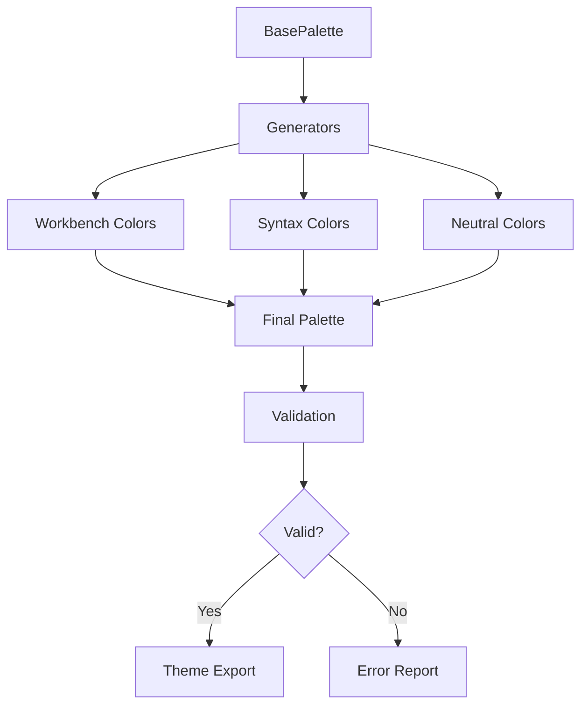

# План миграции палитры "Спокойная Четкость"

## Обзор

Этот документ описывает план миграции архитектуры палитры темы "Спокойная Четкость" от статической структуры к модульной системе с автоматической генерацией цветов. Цель - упростить поддержку, повысить гибкость и обеспечить соответствие требованиям контрастности WCAG.

## Текущая архитектура и проблемы

### Текущая структура

Палитра реализована как статический объект `CalmClarityPalette` с более чем 50 жестко заданными цветами:

- **Workbench**: цвета интерфейса (фоны, текст, границы, акценты)
- **Button**: цвета кнопок
- **Syntax**: цвета подсветки синтаксиса (20+ категорий)
- **Neutral**: нейтральные серо-голубые оттенки
- **Alpha**: уровни прозрачности (subtle, hover, active, semiOpaque)
- **Shadow**: цвета теней
- **Controls, Minimap, OverviewRuler, ScmGraph**: специализированные цвета

### Выявленные проблемы

1. **Избыточность**: 50+ цветов определены статически, затрудняя модификацию
2. **Отсутствие систематической генерации**: цвета яркости задаются вручную
3. **Сложность поддержки**: изменение базового цвета требует обновления множества связанных цветов
4. **Ограниченная модульность**: цвета жестко связаны, сложно переиспользовать
5. **Риск несоответствия контрастности**: отсутствие автоматической проверки WCAG

## Предлагаемая архитектура

### Минимальная базовая палитра

Создать объект `BasePalette` с 5-7 базовыми цветами, из которых генерируются все остальные:

```typescript
interface BasePalette {
  background: string    // #10141a - основной темный синий фон
  accent: string        // #7ab4e6 - основной акцентный цвет
  syntaxPurple: string  // #bb9af7 - для ключевых слов и типов
  syntaxGreen: string   // #9ece6a - для строк и успехов
  neutral: string       // #3a4a60 - для вспомогательных элементов
  syntaxYellow?: string // #e0af68 - опционально для предупреждений
  syntaxCyan?: string   // #7dcfff - опционально для функций
}
```

### Механизмы генерации яркости

Внедрить функции для систематической генерации градаций яркости на основе HSL-модели:

```typescript
// Генерация светлее/темнее
function lighten(color: string, amount: number): string {
  // amount: 0.0-1.0 (0.1 = +10% яркости)
}

function darken(color: string, amount: number): string {
  // amount: 0.0-1.0 (0.1 = -10% яркости)
}

// Генерация семейства фонов
function generateBackgroundVariants(base: string): BackgroundVariants {
  return {
    base,
    secondary: lighten(base, 0.05),  // +5% яркости
    tertiary: lighten(base, 0.1),    // +10% яркости
    sidebar: lighten(base, 0.02),    // +2% яркости
    // ...
  }
}
```

### Улучшенная система прозрачности

Расширить систему alpha с автоматической генерацией произвольных значений:

```typescript
interface AlphaSystem {
  subtle: string     // 20% (33)
  hover: string      // 40% (66)
  active: string     // 60% (99)
  semiOpaque: string // 80% (cc)
}

// Универсальная функция с произвольной прозрачностью
function withAlpha(color: string, alpha: number): string {
  // alpha: 0.0-1.0
  const hex = color.replace('#', '')
  const alphaHex = Math.round(alpha * 255).toString(16).padStart(2, '0')
  return `#${hex}${alphaHex}`
}
```

### Модульная архитектура

Организовать палитру в отдельные модули для лучшей поддерживаемости:

```
src/theme/palette/
├── base.ts           // базовые цвета и интерфейсы
├── generators.ts     // функции генерации яркости и прозрачности
├── color-utils.ts    // утилиты работы с цветами (HSL, контрастность)
├── workbench.ts      // генерация цветов интерфейса
├── syntax.ts         // генерация цветов подсветки синтаксиса
├── validation.ts     // валидация контрастности WCAG
├── index.ts          // композиция финальной палитры
```

### Система валидации контрастности

Усилить проверку соответствия WCAG с автоматической валидацией:

```typescript
interface ContrastRequirements {
  minimumRatio: number  // 4.5 для AA, 7.0 для AAA
  background: string
  validateOnBuild: boolean
}

interface ValidationResult {
  isValid: boolean
  violations: ContrastViolation[]
  suggestions: string[]
}

function validatePaletteContrast(palette: Palette): ValidationResult {
  // Проверка всех критических пар цветов
}
```

## Диаграмма архитектуры



## Пошаговый план миграции

### Этап 1: Подготовка (1-2 дня)
- [ ] Создать базовые интерфейсы и типы в `base.ts`
- [ ] Реализовать функции генерации яркости в `generators.ts`
- [ ] Создать утилиты работы с цветами в `color-utils.ts`
- [ ] Написать тесты для новых функций

### Этап 2: Миграция интерфейса (2-3 дня)
- [ ] Создать генератор цветов workbench в `workbench.ts`
- [ ] Перенести существующие цвета на генерацию
- [ ] Обновить `utils.ts` для использования новых генераторов
- [ ] Проверить визуальную идентичность

### Этап 3: Миграция синтаксиса (2-3 дня)
- [ ] Создать генератор цветов синтаксиса в `syntax.ts`
- [ ] Интегрировать с существующей логикой `calm-clarity-syntax.ts`
- [ ] Обеспечить обратную совместимость
- [ ] Тестировать подсветку в различных языках

### Этап 4: Валидация и оптимизация (1-2 дня)
- [ ] Реализовать систему валидации контрастности в `validation.ts`
- [ ] Добавить автоматические проверки в процесс сборки
- [ ] Оптимизировать производительность генераторов
- [ ] Обновить документацию

### Этап 5: Финализация (1 день)
- [ ] Удалить устаревший код
- [ ] Обновить импорты в генераторе темы
- [ ] Провести финальное тестирование
- [ ] Обновить CHANGELOG

## Преимущества новой архитектуры

- **Упрощение поддержки**: изменение базового цвета автоматически обновляет все производные
- **Гибкость**: легкое создание вариаций темы (высокая контрастность, светлая версия)
- **Модульность**: переиспользование цветов в разных контекстах
- **Надежность**: автоматическая проверка контрастности WCAG
- **Производительность**: меньший размер палитры при той же функциональности

## Риски и mitigation

- **Риск регрессии**: тщательное тестирование визуальной идентичности
- **Производительность**: оптимизация генераторов, кэширование результатов
- **Сложность**: постепенная миграция с сохранением обратной совместимости

## Следующие шаги

После утверждения этого плана, перейти к реализации в режиме code для создания новой архитектуры палитры.