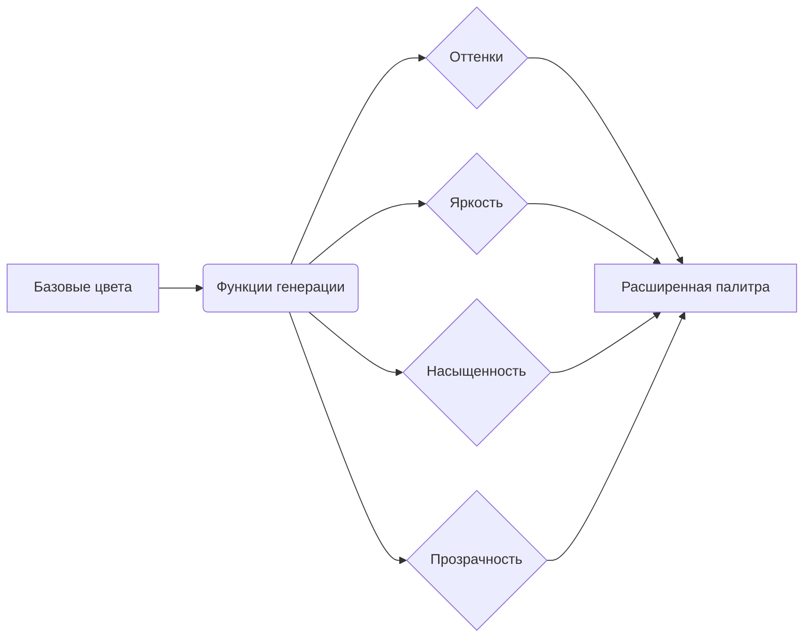

# Дизайн палитры

## Введение

В этом документе описан дизайн новой палитры с улучшенной семантикой. Палитра разделена на базовую и расширенную. Базовая палитра содержит ключевые цвета, которые можно переиспользовать. Расширенная палитра генерируется на основе базовой с помощью утилит работы с цветом.

## Базовая палитра

Базовая палитра содержит следующие ключевые цвета:

- `background-primary`: Основной фон редактора (`#171727`)
- `background-secondary`: Фон для UI элементов (`#1e1e33`)
- `background-tertiary`: Фон для модальных окон и панелей (`#212138`)
- `text-primary`: Основной текст (`#a8b5f3`)
- `text-secondary`: Вторичный текст (`#767ea8`)
- `text-muted`: Приглушенный текст (`#576081`)
- `accent-primary`: Основной акцент (синий, `#7aa2f7`)
- `accent-secondary`: Вторичный акцент (фиолетовый, `#bb9af7`)
- `accent-error`: Цвет для ошибок (красный, `#f7768e`)
- `accent-warning`: Цвет для предупреждений (желтый, `#e0af68`)
- `accent-success`: Цвет для успеха (зеленый, `#9ece6a`)
- `accent-info`: Цвет для информации (циан, `#0db9d7`)
- `border-primary`: Основной цвет границ (`#2b2b3b`)
- `border-secondary`: Вторичный цвет границ (`#42465d`)

## Система генерации расширенной палитры

Расширенная палитра генерируется на основе базовой с помощью утилит работы с цветом, реализованных в файле `src/theme/utils/color.ts`. Эти утилиты позволяют создавать вариации цветов, такие как:

- **Оттенки (Shades):** `shade(color, amount)` - создает более темный оттенок цвета.
- **Вариации яркости:** `lighten(color, amount)` и `darken(color, amount)` - осветляет или затемняет цвет.
- **Вариации насыщенности:** `saturate(color, amount)` и `desaturate(color, amount)` - увеличивает или уменьшает насыщенность цвета.
- **Прозрачность:** `alpha(color, amount)` - добавляет прозрачность к цвету.

Для каждого базового цвета автоматически генерируются следующие вариации:

- `color-light`: `lighten(color, 0.2)`
- `color-dark`: `darken(color, 0.2)`
- `color-saturated`: `saturate(color, 0.3)`
- `color-desaturated`: `desaturate(color, 0.3)`
- `color-shade`: `shade(color, 0.2)`
- `color-tint`: `tint(color, 0.2)`
- `color-alpha-50`: `alpha(color, 0.5)`
- `color-alpha-25`: `alpha(color, 0.25)`

## Преимущества

- **Уменьшение количества повторяющихся цветов:** Все вариации цветов генерируются на основе базовых, что исключает дублирование.
- **Упрощение обслуживания:** Изменение базового цвета автоматически обновляет все его вариации.
- **Более последовательная и гибкая палитра:** Семантические имена и система генерации обеспечивают согласованность и легкость в использовании.

## Контрастность и доступность

Проверка контрастности между цветами фона и текста показала, что цвета `text-secondary` и `text-muted` не соответствуют минимальному соотношению контрастности 4.5:1 с темным фоном. Для обеспечения доступности темы, эти цвета будут корректироваться с помощью функции `ensureContrast` при использовании на темном фоне.

## Пример использования

Пример генерации расширенной палитры можно найти в файле `src/theme/palette/generator.ts`.

## Диаграмма генерации палитры



## Форматы цветов в VSCode темах

В VSCode темах поддерживаются следующие форматы цветов для определения палитры:

### HEX формат

HEX (шестнадцатеричный) формат - это наиболее распространенный способ определения цветов в VSCode темах. В темах Tokyo Night поддерживаются только следующие форматы:

- `#RGB` - 3-символьный формат (например, `#f00` для красного)
- `#RGBA` - 4-символьный формат с альфа-каналом (например, `#f00a` для полупрозрачного красного)
- `#RRGGBB` - 6-символьный формат (например, `#ff0000` для красного)
- `#RRGGBBAA` - 8-символьный формат с альфа-каналом (например, `#ff0000aa` для полупрозрачного красного)

Примеры использования в теме:

```json
{
 "colors": {
   "editor.background": "#1a1b26",
   "editor.foreground": "#a9b1d6",
   "editor.lineHighlightBackground": "#22243680"
 }
}
```
