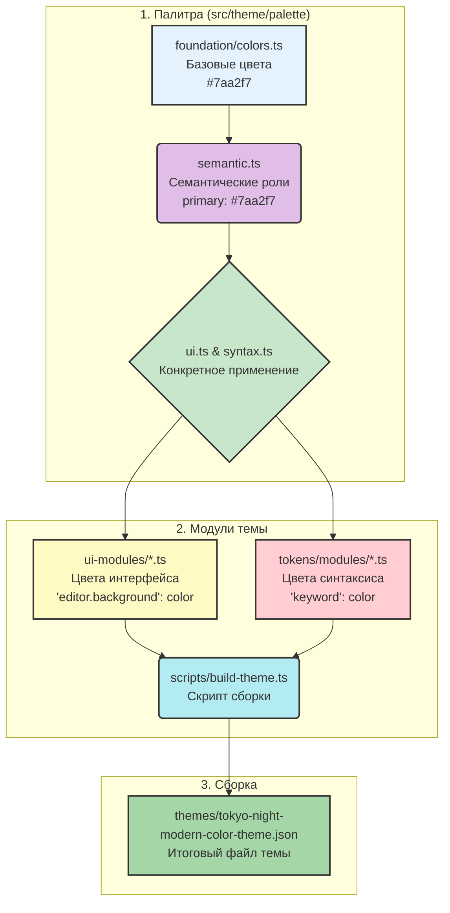

# Анализ архитектуры цветовой системы Tokyo Night Modern

Этот документ описывает текущую архитектуру цветовой системы и процесс генерации темы в проекте Tokyo Night Modern.

## 1. Структура палитры

Цветовая палитра организована в виде иерархической структуры, состоящей из нескольких уровней абстракции. Это позволяет отделить базовые значения цветов от их семантического и функционального назначения.

**Путь:** `src/theme/palette/`

### Уровень 1: Foundation (Основа)

Это самый низкий уровень, определяющий "сырые" цветовые значения.

- **`foundation/colors.ts`**: Содержит экспорт `foundationColors` — объекта с базовым набором цветов (например, `blue500: '#7aa2f7'`). Эти цвета являются строительными блоками для всей системы.
- **`foundation/opacity.ts`**: Определяет уровни прозрачности, которые могут применяться к базовым цветам.

### Уровень 2: Semantic (Семантика)

На этом уровне базовым цветам присваивается семантическое значение, описывающее их роль в интерфейсе.

- **`semantic.ts`**: Импортирует `foundationColors` и создает `semanticColors`. Здесь цвету `#7aa2f7` (blue500) присваивается роль `primary`. Другие примеры: `success`, `error`, `background`, `text`. Это позволяет изменять базовые цвета, не затрагивая их логическую роль.

### Уровень 3: UI и Syntax (Интерфейс и Синтаксис)

Этот уровень использует семантические цвета для конкретных компонентов.

- **`ui.ts`**: Определяет цвета для общих элементов интерфейса, таких как `backgrounds`, `text`, `borders`. Он использует `semanticColors` для создания более специфичных вариантов (например, `backgrounds.primary` ссылается на `semanticColors.background`).
- **`syntax.ts`**: Задает цвета для подсветки синтаксиса, также опираясь на семантические роли (например, `keyword` использует `semanticColors.secondary`).

## 2. Процесс генерации темы

Процесс сборки темы автоматизирован и выполняется с помощью скрипта, который компилирует все цветовые определения в единый JSON-файл.

**Основной скрипт:** `scripts/build-theme.ts`

### Шаг 1: Импорт цветовых модулей

Скрипт импортирует три основных компонента:

1. **`colors` из `src/theme/ui`**: Объект, содержащий сопоставление ключей темы VS Code (например, `editor.background`) с цветами из `ui.ts` и `semantic.ts`. Эти определения находятся в директории `src/theme/ui-modules/`.
2. **`tokenColors` из `src/theme/tokens`**: Массив объектов, определяющих цвета для подсветки синтаксиса. Каждый объект задает `scope` (например, `comment`, `keyword`) и `settings` (цвет и стиль шрифта). Эти правила собираются из модулей в `src/theme/tokens/modules/`.
3. **`semanticTokenColors` из `src/theme/semantic`**: Объект, который включает семантическую подсветку и определяет цвета для таких элементов, как `class`, `method`, `variable`.

### Шаг 2: Сборка итогового объекта темы

Скрипт создает объект `theme`, который включает в себя:

- Имя и тип темы.
- `colors`: для интерфейса.
- `tokenColors`: для синтаксиса.
- `semanticTokenColors`: для семантической подсветки.

### Шаг 3: Запись в файл

Готовый объект `theme` сериализуется в JSON и записывается в файл `themes/tokyo-night-modern-color-theme.json`. Этот файл напрямую используется VS Code для отображения темы.

## 3. Общая схема работы

Ниже представлена диаграмма, иллюстрирующая весь процесс — от определения базовых цветов до генерации конечного файла темы.

Этот структурированный подход обеспечивает высокую поддерживаемость и масштабируемость цветовой системы.
