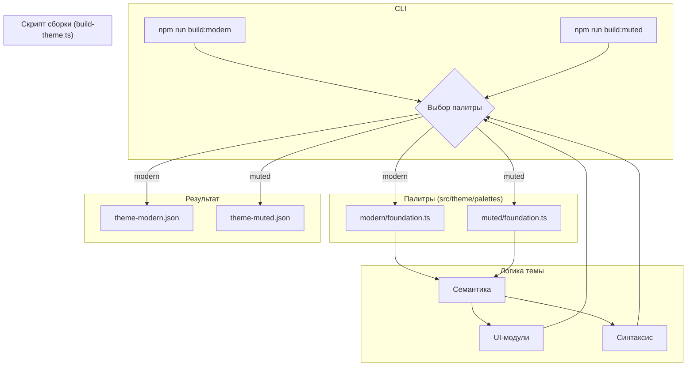

# План улучшения архитектуры и новая цветовая палитра "Muted"

Этот документ описывает план по рефакторингу архитектуры системы сборки тем и представляет новую, "приглушенную" цветовую палитру.

## 1. Анализ слабых мест

Первичный анализ показал, что текущая архитектура, хоть и является гибкой, имеет ряд недостатков, препятствующих её масштабированию:

* **Жесткая связь:** Скрипт сборки (`scripts/build-theme.ts`) и семантические файлы жестко привязаны к единственной палитре `foundation/colors.ts`. Это делает невозможным добавление новых тем без дублирования кода или ручного вмешательства.
* **Отсутствие масштабируемости:** Текущая структура не рассчитана на управление несколькими темами. Попытка добавить новую палитру "рядом" приведет к путанице и усложнит поддержку.
* **Монолитный генератор:** Скрипт сборки выполняет все задачи в одном потоке, что усложняет его модификацию для поддержки разных конфигураций.

## 2. План архитектурных улучшений

Для устранения этих проблем предлагается следующий план рефакторинга:

### Шаг 1: Реструктуризация директории с палитрами

1. Создать новую корневую директорию `src/theme/palettes`.
2. Внутри `src/theme/palettes` создать две поддиректории:
    * `modern` — для существующей палитры.
    * `muted` — для новой приглушенной палитры.
3. Переместить существующий файл `src/theme/palette/foundation/colors.ts` в `src/theme/palettes/modern/foundation.ts`.
4. Создать новый файл `src/theme/palettes/muted/foundation.ts` для новой палитры.

### Шаг 2: Параметризация скрипта сборки

1. Модифицировать скрипт `scripts/build-theme.ts` для приема аргумента командной строки (например, `--palette=muted`).
2. Скрипт должен динамически определять путь к файлу палитры на основе этого аргумента.
3. Имя выходного JSON-файла также должно формироваться динамически (например, `tokyo-night-modern-muted.json`).
4. Обновить раздел `scripts` в `package.json`, добавив команды для сборки каждой темы:

    ```json
    "scripts": {
      "build": "npm run build:modern",
      "build:modern": "ts-node scripts/build-theme.ts --palette=modern",
      "build:muted": "ts-node scripts/build-theme.ts --palette=muted"
    }
    ```

### Шаг 3: Динамический импорт палитры

Реализовать в генераторе механизм, который будет передавать выбранную палитру в семантические модули и модули UI, устраняя прямые импорты базовых цветов.

### Схема новой архитектуры (Mermaid)



## 3. Новая цветовая палитра "Muted"

Палитра разработана для комфортной длительной работы, с пониженной яркостью, но достаточной контрастностью.

### Основные цвета интерфейса

* **Фон (bg):** `#1A1B26` (существующий, для преемственности)
* **Основной фон (bg-main):** `#232533` (чуть светлее и мягче)
* **Границы (border):** `#343644`
* **Акцентный цвет (accent):** `#7A88CF` (приглушенный сине-фиолетовый)

### Цвета для подсветки синтаксиса

* **Комментарии (comment):** `#6B7089` (нейтральный серо-синий)
* **Ключевые слова (keyword):** `#A989C5` (мягкий лавандовый)
* **Строки (string):** `#9DBA9F` (приглушенный мятный)
* **Числа и константы (number, constant):** `#F792A1` (теплый коралловый)
* **Функции и классы (function, class):** `#7AA2F7` (спокойный синий)
* **Переменные (variable):** `#C0CAF5` (светлый серо-голубой, основной текст)

## 4. План интеграции

1. **Реализация архитектурных улучшений:** Внести изменения в структуру файлов и скрипт сборки согласно плану.
2. **Создание файла палитры "Muted":** Создать файл `src/theme/palettes/muted/foundation.ts` и наполнить его новыми HEX-кодами.
3. **Сборка и тестирование:** Запустить команду `npm run build:muted` для генерации новой темы.
4. **Визуальная проверка:** Установить сгенерированную тему в VS Code и провести тщательную визуальную проверку всех элементов интерфейса и подсветки синтаксиса на читаемость и гармоничность.
